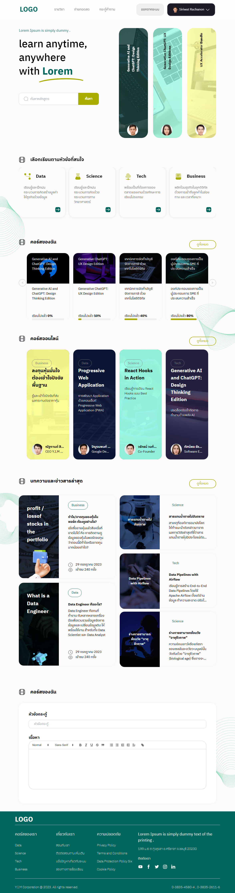

# UI Test Project

## 📖 Overview
This project is a UI test created to showcase skills in user interface design. The goal is to implement a responsive and user-friendly UI based on given specifications.

## 🚀 Features
- Responsive design
- Intuitive navigation
- Modern aesthetics

## 🎨 Technologies Used
- React
- Tailwind CSS

## 🙏 Acknowledgments
Thank you for the opportunity to demonstrate my skills.

# โครงการทดสอบ UI

## 📖 ภาพรวม
โครงการนี้เป็นการทดสอบ UI ที่สร้างขึ้นเพื่อแสดงทักษะในการออกแบบส่วนติดต่อผู้ใช้ เป้าหมายคือการสร้าง UI ที่ตอบสนองและใช้งานง่ายตามข้อกำหนดที่ให้มา

## 🚀 ฟีเจอร์
- การออกแบบที่ตอบสนอง
- การนำทางที่ใช้งานง่าย
- สวยงามตามมาตรฐานสมัยใหม่

## 🎨 เทคโนโลยีที่ใช้
- React
- Tailwind CSS

## 🙏 ขอบคุณ
ขอบคุณสำหรับโอกาสในการแสดงทักษะของฉัน

